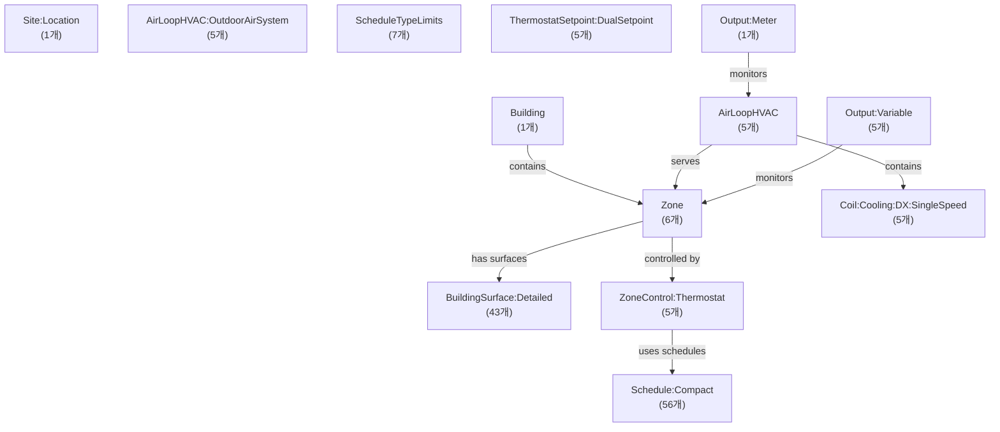

# EnergyPlus Building Model Structure

## Object Relationship Diagram

```mermaid
graph TB
    %% EnergyPlus Building Model Structure

    %% Building
    node0["Building<br/>(1개)"]
    node1["Site:Location<br/>(1개)"]

    %% Zones
    node2["Zone<br/>(6개)"]

    %% Surfaces
    node3["BuildingSurface:Detailed<br/>(43개)"]

    %% HVAC_System
    node4["AirLoopHVAC<br/>(5개)"]
    node5["AirLoopHVAC:OutdoorAirSystem<br/>(5개)"]

    %% HVAC_Equipment
    node6["Coil:Cooling:DX:SingleSpeed<br/>(5개)"]

    %% Schedules
    node7["Schedule:Compact<br/>(56개)"]
    node8["ScheduleTypeLimits<br/>(7개)"]

    %% Thermostats
    node9["ZoneControl:Thermostat<br/>(5개)"]
    node10["ThermostatSetpoint:DualSetpoint<br/>(5개)"]

    %% EMS

    %% Output
    node11["Output:Variable<br/>(5개)"]
    node12["Output:Meter<br/>(1개)"]

    %% Relationships
    node0 -->|contains| node2
    node2 -->|has surfaces| node3
    node2 -->|controlled by| node9
    node9 -->|uses schedules| node7
    node4 -->|contains| node6
    node4 -->|serves| node2
    node11 -->|monitors| node2
    node12 -->|monitors| node4

    %% Styling
    classDef buildingClass fill:#FFE6E6,stroke:#333,stroke-width:2px
    classDef zoneClass fill:#E6F3FF,stroke:#333,stroke-width:2px
    classDef hvacClass fill:#FFF9E6,stroke:#333,stroke-width:2px
    classDef emsClass fill:#FFEBE6,stroke:#333,stroke-width:2px
```
